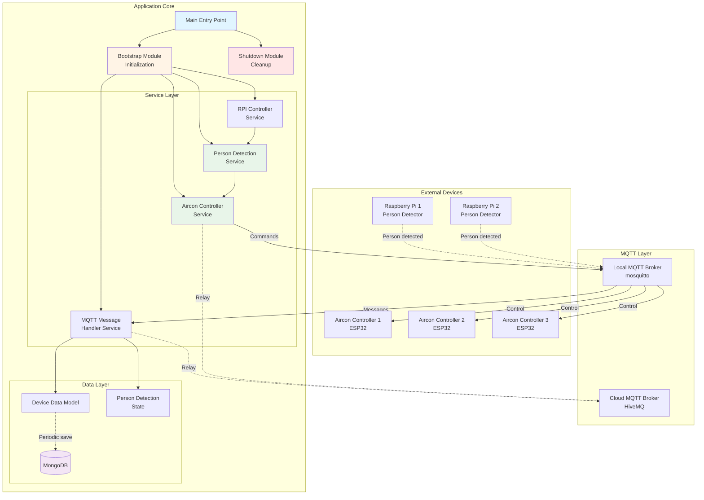
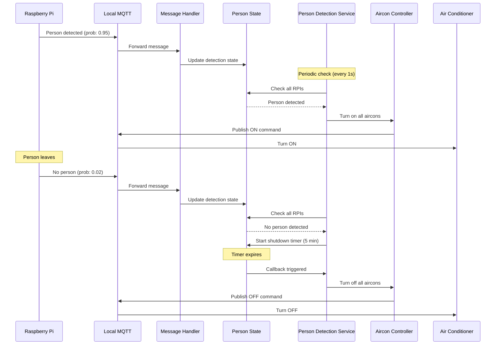

# Architecture Documentation

## Air Conditioning Controller Server

---

## Overview

This is an IoT server application that automatically controls air conditioners based on person detection from Raspberry Pi devices. The system uses MQTT for device communication and MongoDB for data persistence.

### Technology Stack

- **Runtime**: Node.js with TypeScript
- **Messaging**: MQTT (Local & Cloud brokers)
- **Database**: MongoDB
- **IoT Devices**: Raspberry Pi (with camera/person detection), ESP32 Air Conditioner Controllers

---

## System Architecture



---

## Component Descriptions

### Core Modules

#### `index.ts` (Entry Point)

- **Lines**: 34 (simplified from 222)
- **Purpose**: Application entry point
- **Responsibilities**:
  - Load environment variables
  - Bootstrap application
  - Setup graceful shutdown handlers

#### `bootstrap.ts` (Initialization)

- **Lines**: ~170
- **Purpose**: Application initialization and dependency wiring
- **Responsibilities**:
  - Initialize all models and services
  - Connect to MQTT brokers
  - Connect to MongoDB
  - Start device controller
  - Return application context

#### `shutdown.ts` (Cleanup)

- **Lines**: ~95
- **Purpose**: Graceful shutdown and resource cleanup
- **Responsibilities**:
  - Stop all services
  - Publish offline status to MQTT
  - Disconnect from MQTT brokers
  - Disconnect from MongoDB
  - Handle process signals (SIGINT, SIGTERM)

---

### Service Layer

#### AirconControllerService

**Purpose**: Centralized air conditioner control logic

**Key Methods**:

- `setAllControllers(command, reason)` - Control all aircons
- `setSingleController(id, command, reason)` - Control single aircon
- `turnOnAll(reason)` / `turnOffAll(reason)` - Convenience methods

**Design Pattern**: Single Responsibility - All aircon control logic in one place

---

#### PersonDetectionService

**Purpose**: Person detection logic and automated aircon control

**Workflow**:

1. Check person detection from all RPIs
2. If person detected → Turn on aircons
3. If no person detected → Start shutdown timer
4. If timer expires → Turn off aircons
5. If person reappears → Cancel timer, turn on aircons

**Configuration**:

- `airconPowerOffDuration`: Delay before turning off (default: 5 minutes)

---

#### RaspberrypiService (Device Controller)

**Purpose**: Periodic monitoring and control coordination

**Workflow**:

```
Every N milliseconds (eventProcessInterval):
  1. Update timestamp
  2. Check RPI status:
     - If all RPIs offline → Turn off all aircons
     - If any RPI online → Execute person detection logic
  3. MongoDB saves data periodically (separate timer)
```

---

#### LocalMqttService & CloudMqttService

**Purpose**: MQTT broker connection management

**Features**:

- Auto-reconnection on failure
- Non-blocking initialization
- Exponential backoff retry mechanism
- Support for legacy and new topic formats

**Topic Mapping**:

```
Legacy Format:
- myFinalProject/rpi1/objDetector
- myFinalProject/airconController1/command

New Format:
- myFinalProject/rpi_<MAC>/objDetector
- myFinalProject/server/airconController/<ID>/command
```

---

#### MqttMessageHandlerService

**Purpose**: Process incoming MQTT messages

**Message Types Handled**:

1. **Person Detection**: `*/objDetector` → Update detection state
2. **RPI Status**: `*/onlineStatus/online` → Update RPI online/offline
3. **Aircon Measurements**: `*/measure` → Update power metrics
4. **Aircon Properties**: `*/properties` → Update aircon status

---

### Data Models

#### DeviceDataModel

**Purpose**: Central state management for all devices

**State Structure**:

```typescript
{
  timeStamp: Date,
  MQTTbroker: { online: boolean },
  rpi: [
    { online: boolean, isperson: boolean, prob: number }
  ],
  airconController: [
    {
      controllercmd: boolean,
      properties: { wifiLocalIP, online, bootcount },
      measure: { voltage, current, power, energy, frequency }
    }
  ]
}
```

**Features**:

- Dynamic array expansion for new devices
- Centralized state queries (areAllRpisOffline, isAnyRpiOnline)

---

#### PersonDetectionState

**Purpose**: Track person detection and manage shutdown timer

**Key Features**:

- Store detection messages from multiple RPIs
- Manage shutdown timer (clear/start)
- Track current person presence state

---

## Data Flow

### Person Detection Flow



---

## Configuration

### Environment Variables (`.env`)

```bash
# MongoDB Configuration
MONGODB_URI=mongodb://localhost:27017/iot-controller

# Local MQTT Broker
LOCAL_MQTT_HOST=localhost
LOCAL_MQTT_PORT=1883
LOCAL_MQTT_USERNAME=admin
LOCAL_MQTT_PASSWORD=password

# Cloud MQTT Broker (HiveMQ)
CLOUD_MQTT_HOST=broker.hivemq.com
CLOUD_MQTT_PORT=1883
CLOUD_MQTT_USERNAME=
CLOUD_MQTT_PASSWORD=

# Application Settings
EVENT_PROCESS_INTERVAL=1000          # 1 second
AIRCON_POWER_OFF_DURATION=300000     # 5 minutes
MONGODB_SAVE_INTERVAL=5000           # 5 seconds
```

### Constants (`src/config/constants.ts`)

```typescript
MQTT_CONFIG:
  - RECONNECT_INTERVAL: 30000 ms (30 seconds)
  - MAX_RETRY_ATTEMPTS: 3
  - RETRY_BACKOFF_BASE: 2 (exponential backoff)

AIRCON_CONFIG:
  - CONTROLLER_COUNT: 3
  - DEFAULT_POWER_OFF_DURATION: 300000 ms (5 minutes)

MQTT_QOS:
  - AT_MOST_ONCE: 0
  - AT_LEAST_ONCE: 1
  - EXACTLY_ONCE: 2
```

---

## Design Patterns & Principles

### 1. **Separation of Concerns**

- Entry point (`index.ts`) separate from initialization (`bootstrap.ts`)
- Shutdown logic isolated in `shutdown.ts`
- Each service has single responsibility

### 2. **Single Responsibility Principle**

- **AirconControllerService**: Only handles aircon control
- **PersonDetectionService**: Only handles detection logic
- **MqttMessageHandlerService**: Only handles message parsing

### 3. **Service-Oriented Architecture**

- Clear service boundaries
- Services communicate through well-defined interfaces
- Each service is independently testable

### 4. **Non-Blocking Initialization**

- MQTT connection failures don't crash the app
- MongoDB failures don't prevent startup
- Auto-reconnection mechanisms

### 5. **Resilient Design**

- Graceful degradation when services are unavailable
- Comprehensive error handling
- Automatic recovery mechanisms

---

## Key Improvements from Refactoring

### Before vs After

| Aspect               | Before                                           | After                                      | Improvement   |
| -------------------- | ------------------------------------------------ | ------------------------------------------ | ------------- |
| **index.ts size**    | 222 lines                                        | 34 lines                                   | 85% reduction |
| **Code duplication** | ~150 lines duplicated                            | 0 (centralized in AirconControllerService) | Eliminated    |
| **Magic numbers**    | Scattered throughout                             | Centralized in constants.ts                | Maintainable  |
| **Service coupling** | Tight (services created dependencies internally) | Loose (dependencies injected)              | Testable      |
| **Responsibilities** | Mixed (init + shutdown + entry)                  | Separated (3 focused modules)              | Clear         |

---

## Deployment

### Running the Application

```bash
# Development mode (with auto-reload)
npm run start:dev

# Production mode (compiled)
npm run build
npm start
```

### Docker Deployment

```bash
# Build image
docker build -t aircon-controller .

# Run container
docker run -d \
  --name aircon-controller \
  --env-file .env \
  --network host \
  aircon-controller
```

---

## Monitoring & Debugging

### Log Levels

- **INFO**: Normal operation events
- **WARN**: Non-critical issues (reconnection attempts, etc.)
- **ERROR**: Critical errors that need attention
- **DEBUG**: Detailed debugging information

###健康チェック (Health Checks)

Monitor these indicators:

- ✅ Local MQTT connected
- ✅ Cloud MQTT connected
- ✅ MongoDB connected
- ✅ At least one RPI online

---

## Future Enhancements

1. **Unit Tests**: Add comprehensive test coverage
2. **API Layer**: Add REST API for manual control
3. **Dashboard**: Real-time monitoring UI
4. **Advanced Logic**: ML-based occupancy prediction
5. **Multi-room Support**: Independent control per room

---

## Troubleshooting

### Common Issues

**Issue**: MQTT not connecting

- **Check**: Broker is running and accessible
- **Check**: Credentials in `.env` are correct
- **Watch**: Auto-reconnection logs (every 30s)

**Issue**: Aircons not responding

- **Check**: Controllers are online (`*/properties/online`)
- **Check**: Local MQTT is connected
- **Debug**: Watch MQTT message logs

**Issue**: Person detection not working

- **Check**: RPIs are online and publishing
- **Check**: Detection probability threshold (default: >0.5)
- **Debug**: Check PersonDetectionState logs

---

> [!NOTE]
> This documentation reflects the refactored architecture with improved separation of concerns, reduced code duplication, and centralized configuration management.
